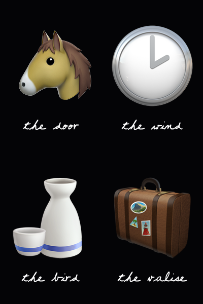

## key of dreams

a bot that generates emoji magrittes.



this is a bot that generates images and posts them to mastodon ~~and twitter~~. it's written in [typescript](https://www.typescriptlang.org/) and runs on [node.js](http://nodejs.org/).

you can run it on your computer or remix it into something new! you'll need node and git installed. if you install node manually, you should match the node version listed in [the `.node-version`](.node-version) file — but instead of installing node directly i recommend using [fnm](https://github.com/Schniz/fnm), which can automatically handle installing and switching node versions by detecting `.node-version` files.

once you're set, run:

```sh
git clone https://github.com/lostfictions/key-of-dreams
cd key-of-dreams
corepack enable # enables use of the pnpm package manager
pnpm install
pnpm dev
```

in a server environment, this bot can be run with [docker](https://docs.docker.com/) for an easier time. (i recommend [dokku](http://dokku.viewdocs.io/dokku/) if you're looking for a nice way to develop and host bots.)

running `pnpm dev` will generate images locally, but the bot needs environment variables if you want it to post to the internet:

- `MASTODON_TOKEN`: a Mastodon user API token (required)
- `MASTODON_SERVER`: the instance to which API calls should be made (usually where the bot user lives.) (default: https://botsin.space/)
- `RESOURCE_DIR`: the directory to search for image and font data. (default: the images already checked in to the repo.)

this bot uses [dotenv](https://github.com/motdotla/dotenv), so you can alternately stick any of the above environment variables in a file named `.env` in the project root. (it's gitignored, so there's no risk of accidentally committing private API tokens you put in there.)

###### [more bots?](https://github.com/lostfictions?tab=repositories&q=botally)
